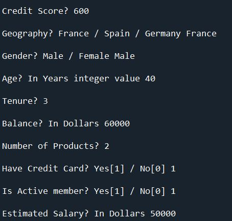
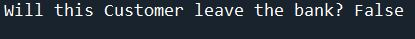

# ANN (Artificial Neural Network)

**Problem Statement**: Given is the dataset for Bank Customers ("Churn_Modelling.csv"). We have to consider all possible columns and predict whether the customer will leave the bank or not?
## Step-by-step Approach

### Import Libraries such as:
* numpy
* pandas
* tensorflow
* LabelEncoder (encode target labels with value between 0 and n_classes-1, such as Gender)
* ColumnTransformer (allows different columns or column subsets of the input to be transformed separately)
* OneHotEncoder (encode categorical features as a numeric array)
* StandardScalar

### Part 1: Data Preprocessing
* Import the dataset using pandas.read_csv
* Encode the "Gender" column using Label Encoder
* Encode the "Geography" column using One Hot Encoder
* Split the dataset to Training and Test Set
* Feature Scaling (this is always necessary while training a neural network to normalize the range of independent variables) using Standard Scalar

### Part 2: Building the ANN
* Initialise the ANN using Sequential from `tf.keras.models` library
* **Input layer** is added automatically on the basis of columns in the dataset
* **First Hidden Layer**:
  * Use `add `function of `Sequential` class for first hidden layer
    * For fully connected layer, we use `Dense` class from `tf.keras.layers` library inside `add` function
      * Parameters passed to `Dense` Class:
      * units -> Number of neurons/nodes. Use experimentation for better results/No thumb rule for this
      * activation -> The function attached to each neuron in the network, and determines whether it should be activated (use `relu`)
* **Second Hidden Layer**:
  * Follow same procedure as in `First Hidden Layer`. [Note: There is currently no theoretical reason to use neural networks with any more than two hidden layers. In fact, for many practical problems, there is no reason to use any more than one hidden layer]
* **Output Layer**:
  * Follow same procedure as in `First Hidden Layer`, except
    * In `Dense` class, use parameters in this way:
      * units -> Depends upon classes present in the output column, in the present dataset, it is either true or false, so use `1`
      * activation -> Use `sigmoid` function

### Part 3: Training the ANN
Since now we have built the ANN, it is of little use without training. So let's train the model on our sample dataset.
* Compile the ANN with `compile` method of `ann` having parameters as:
  * optimizer ->  updates the weights in order to reduce loss error between actual and predicted value in same batch. The `adam` optimization algorithm is an extension to stochastic gradient descent and stands for `adaptive moment estimation`
  * loss -> For binary classification use `binary_crossentropy` and else use `categorical_crossentropy`. Also `activation` param in *output layer* should be [softmax](https://medium.com/data-science-bootcamp/understand-the-softmax-function-in-minutes-f3a59641e86d) instead of `sigmoid` for non-binary classification
  * metrics ->  judge the performance of your model. We can use `accuracy` param here.
* Train the ANN on training set
  * use fit method of `ann` with parameters
    * X_train
    * y_train
    * batch_size for better results instead of single observations. Use default value: `32`
    * epochs for learn co-relations properly, can use `100`

#### Training Process
While the model is trained, the output is rendered as below:

Since we have kept the `epochs` value: `100`. It will continue 100 times and you can see as in image, accuracy will improve over multiple epochs.

### Custom Input
Now we can give our own customized input to the console, something like this:

We have to take care of Label Encoding and One Hot Encoder for categorical columns as we did in dataset preprocessing

### Predicted Output
Use `predict` function of ann object that will return the probability of exit of customer.

The output of the above given input after the model is trained will be:

### Predicting Test set results
Similarly, to predict the test set results, use `predict` function from ann object with parameter of `X_test`. Also for boolean output, we can use threshold value of 0.5, meanining if `y_pred` > 0.5 true else false.

### Confusion Matrix and Accuracy Score
To evaluate the performance of a classification model, let's use these functionalities from `sklearn.metrics` (evaluation is done on the basis of y_pred and y_test)

#### Confusion Matrix:
<table>
  <tr>
    <td>1515</td>
    <td>80</td>
  </tr>
  <tr>
    <td>202</td>
    <td>203</td>
  </tr>
</table>

#### Accuracy Score:  0.859