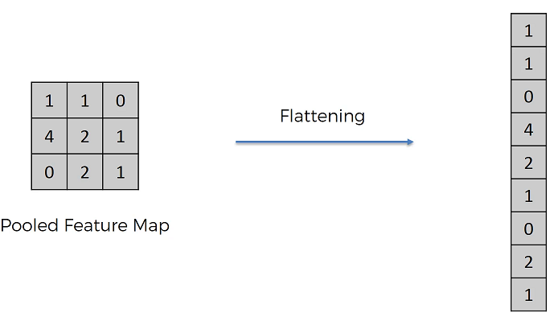
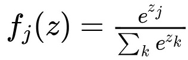

# Deep Learning
This is a repository to learn Deep Learning from Course: [Deep Learning A-Z™: Hands-On Artificial Neural Networks](https://www.udemy.com/course/deeplearning/) on Udemy. The main purpose of this repository is to have a reference of the course practiced by myself on Github (and if possible some modifications) for later point of time.

## Artificial Neural Network:
An artificial neural network (ANN) is the piece of a computing system designed to simulate the way the human brain analyzes and processes information. It is the foundation of artificial intelligence (AI) and solves problems that would prove impossible or difficult by human or statistical standards. ANNs have self-learning capabilities that enable them to produce better results as more data becomes available.

A well defined structure of ANN looks like:

## Convolutional Neural Network:
A Convolutional Neural Network (ConvNet/CNN) is a Deep Learning algorithm which can take in an input image, assign importance (learnable weights and biases) to various aspects/objects in the image and be able to differentiate one from the other.

Here is one famous image

Here if we look at right side of the image, features appears in such a way that the person is looking at the right. While if we look at central part of image, features are more classified as person looking towards us.

The brain struggles to adjust the features and classify the image.

Similarly, there is one more image

Again, the brain struggles to classify the above image as rabbit or duck.

*So how the CNN is able to recognize the features?*
* For Black and White images:
  * CNN takes the image *pixels-by-pixels* and converts it into 2D array. And then it assigns each pixel from 0 (complete black) to 255 (complete white).
* For Colored images:
  * Colored images are also taken *pixels-by-pixels* and then CNN converts it into 3D array (Red, Green and Blue Layer). And each of those layers have their own pixel values ranging from 0 to 255

Here is the illustration:

### Convolution Operation
We are given the below parameters for Convolution Operation:
* Input Image: in the matrix format
* Feature Detector / Kernel / Filter: piece of information which is relevant for solving the computational task related to a certain application
* Stride: steps at which we are moving the feature detector

and the output is

* Feature Map / Activation Map: Smaller and reduced size of the image. We do lose some of the information in this process, but important informations are retained

An image to illustrate this:

Based on multiple features, we can have different filters and therefore mulitple feature maps.

###  ReLU Layer
Rectifier Linear Unit (ReLU) helps break the linearity in the neural network, since the images are highly non-linear.

After the convolution operation, the Feature Maps can output in both black (negative values) and white (positive values). The ReLU helps in achieving only non-negative values in Feature Maps.

### Pooling
Suppose in some scenarios if the features are distorted or are not so much relative, our neural network should have flexibility to be able to find that feature.

**Max Pooling**: This can be achieved by taking empty matrix and applying on Feature Map, in such a way that, we take the max value per stride of empty matrix from Feature Map.

Here we are able to preserve important features and reducing the overall size and parameters that helps prevent overfitting.

**Average Pooling** or **Mean Pooling**: Instead of taking max value, take mean or average per strides.

Here is some fun part on [3D Visualization of a Convolutional Neural Network](https://www.cs.ryerson.ca/~aharley/vis/conv/) where we can draw some numbers and machine predicts which number is it.

### Flattening
This is a process to put all of the pooled layers in a single input layer of future ANN. An image to illustrate the same.

### Full Connection
In ANN, the hidden layers don't have to be fully connected. But in ConvNets we use the fully connected layers. Here each of the neurons fire up / vote upon observing the features that they resemble the most and helps the model to classify the image (Dogs vs Cats in given below image).

### Extras: Softmax and Cross Entropy
**Softmax function**: One interesting part that that how would the model know, for example, that probability of the image to be Dog is 95% and Cat being only 5% (from above example image). The answer is **THEY DON'T**. Instead here Softmax function comes to the rescue. Model just outputs the real value number _z_ (_z1_ for dog and _z2_ for cat, for instance). Then we just have to apply Softmax function and output will be in interval **(0,1)**.

To quote wikipedia

"Prior to applying softmax, some vector components could be negative, or greater than one; and might not sum to 1; but after applying softmax, each component will be in the interval ( 0 , 1 ) and the components will add up to 1, so that they can be interpreted as probabilities."

**Cross Entropy**: Cross Entropy function is much better than Classification Error and Mean Squared Error. The reason being at the very start of back propagation, the output value is very very tiny. Due to this the gradient descent is very low and it will be hard for the Neural Network to adjust weight. But when we use cross entropy, we use _logarithms_ that help to understand the back propagation in a far better way (w.r.t. differences) than Mean Squared Error. 

